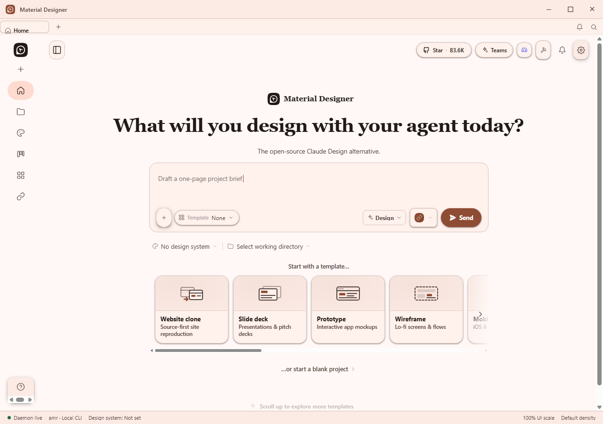
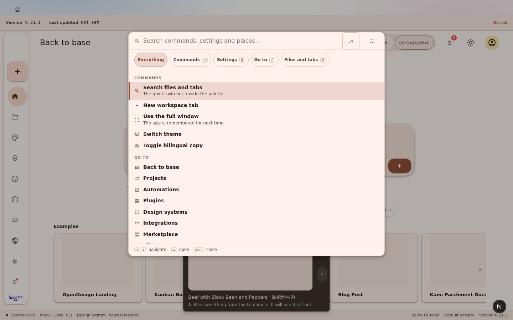
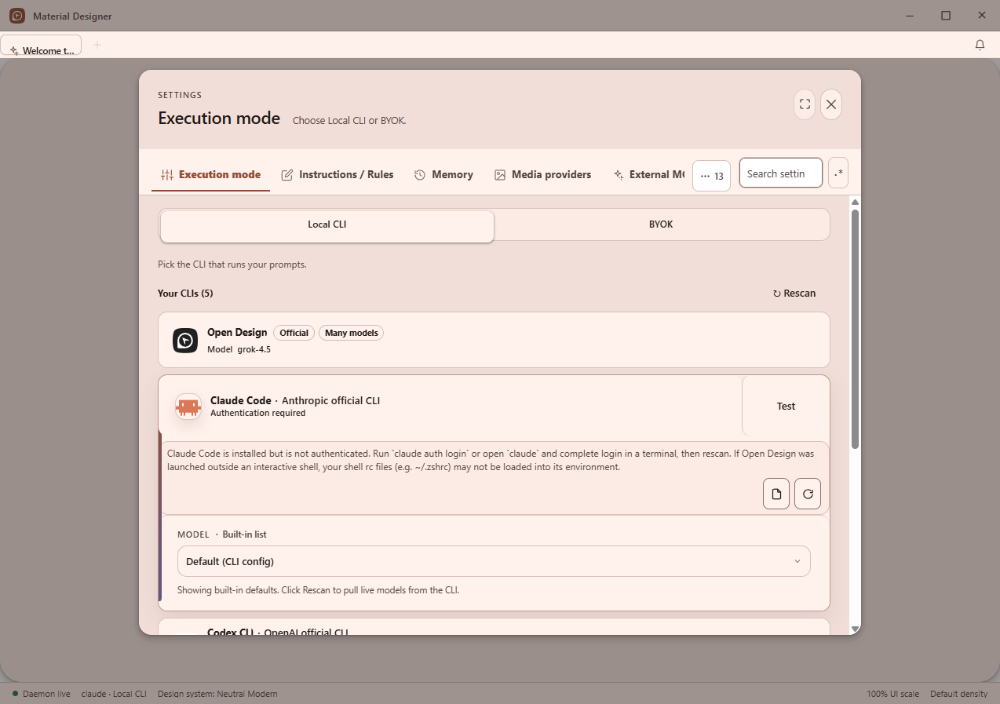
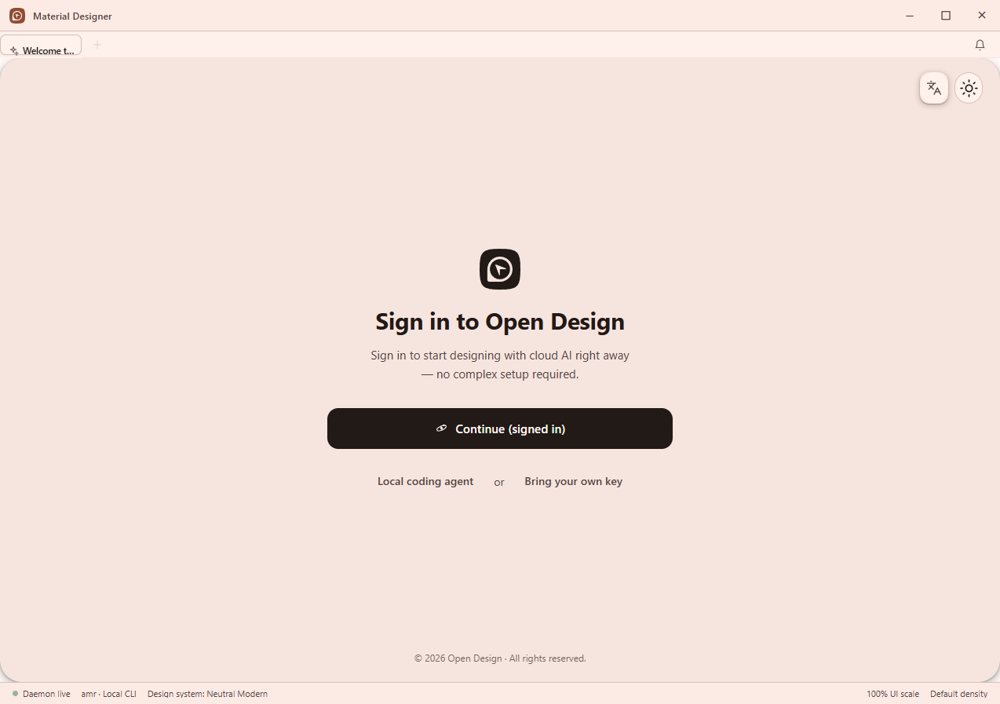
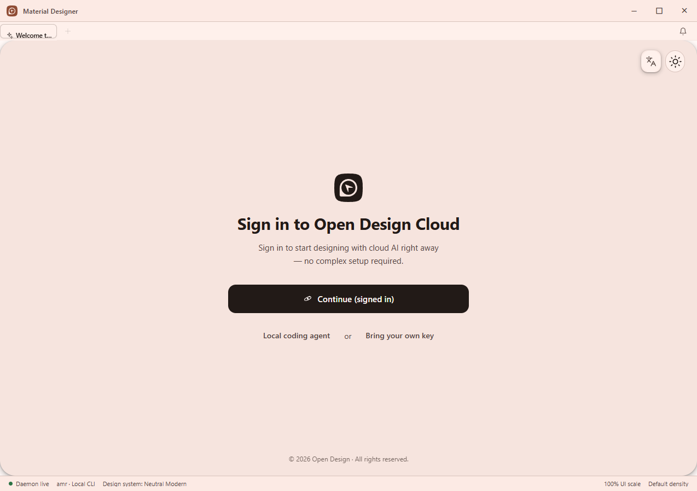
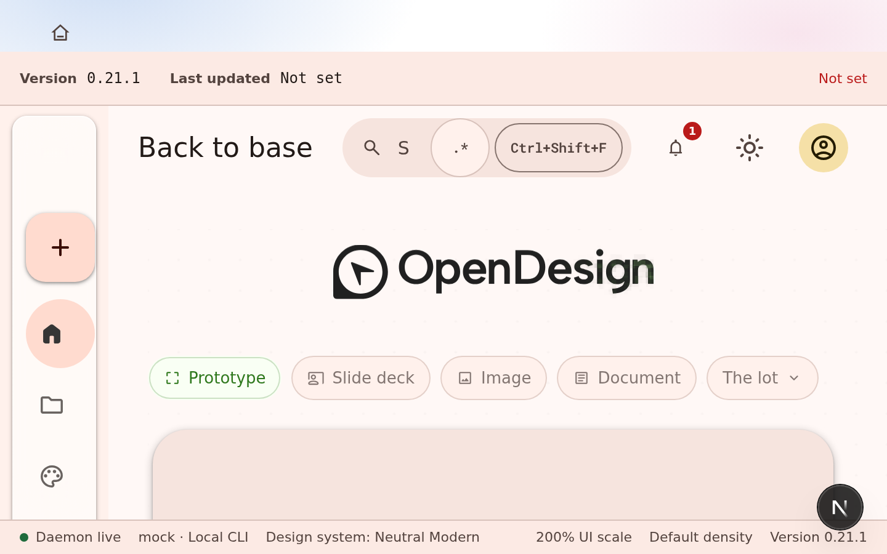

# Material Designer

A local-first design workspace, rebuilt on Material Design 3.




<sub>Not a mockup. This is the packaged application, captured by the smoke test that
installs the built installer, launches it and uninstalls it — built from commit
<code>90e52d3</code>. The capture path is the project's own and the image is committed
unedited. The navigation rail on the left and the 28px status bar along the bottom are
new: until <code>90e52d3</code> the rail was rendered into a zero-width track, so a
fresh install showed no rail at all.</sub>


<sub>Bilingual mode at the narrowest supported window, after the fix. The previous image
here showed the status bar's density readout running off the right edge and the Design
control truncated to <code>Design · …</code> — the segments were flex containers with
<code>text-overflow: ellipsis</code>, which does nothing to an anonymous flex item, so
text hard-clipped mid-glyph with no ellipsis and no way to read the rest. Bilingual pairs
both languages on every label, so it produces the longest strings in the product and is
where clipping appears first; that is why the capture set covers it.</sub>

> [!NOTE]
> **The application ships, and what it ships is now most of the way through the
> standards.** Continuous integration verifies the port, installs the workspace,
> runs the guard, the craft lint and the translation check, typechecks on Linux and
> Windows, runs **563 test files** across five packages, builds a Windows installer and publishes a
> release — and the packaged smoke test installs that build, launches it, has the
> running process answer its own health endpoint and uninstalls it with no residue.
> All observed, every push.
>
> The Cantonese locale, both tone sliders, the regex builder, the command palette,
> the changelog viewer, the startup surprise, tab pinning, the notification centre,
> the destructive-action gate, bulk actions, the appearance editor and the narrator
> are **in the application**, not only on the site. An earlier version of this note
> said otherwise and was months behind the tree.
>
> **The honest gap is no longer "is it built" but "has anyone looked".** One capture
> has been reviewed — the one above — and reviewing it caught the window chrome
> still carrying the upstream brand. Nothing has been checked at a second display
> scale, at a narrow width, or in a second language, and bilingual mode is where
> clipping appears first. See [Status](#status).
>
> **2026-08-06 UI audit update.** Source-level fixes now cover the Figma import
> modal's localized URL/notes labels, bounded scrolling, focus trap and reduced motion;
> the labels now read through `useT` and the existing `dsCreate.*` catalog entries,
> including the standalone English fallback;
> the label follow-up is recorded in [`9c8d492`](https://github.com/Ding-Ding-Projects/material-designer/commit/9c8d4927dce44451bacec50e1c3d38aca837dbcc);
> context-menu wrapping and focus return; updater-dialog focus; the design-system
> Back name;
> the command palette's anchored regex builder and dialog-level Escape dismissal
> from every focused palette control. Its adjacent regex affordance now keeps a
> full 48px keyboard/touch target while the input yields first at narrow widths,
> and a source-level contract guard pins the palette-owned controller. Renderer
> save preparation
> for sketch, markdown and HTML edits before a Squirrel restart. Deferred
> installers require an explicit one-shot authorization marker, re-arm safely
> after a cold start, and revoke those markers during clear-cache. Scrollable
> menus stay open while their own items move, Figma tabs expose real tabpanel
> semantics, long command-palette labels wrap, and a failed installer handoff
> stays retryable. Self-hosted CI now validates its pinned `gh`, `jq` and 7-Zip
> tools in a locked user-scoped cache. Focused tests are committed, but no new
> installed-build capture or new labelled-runner verification is claimed yet.

> **2026-08-06 final Figma import repair.** The six-finding source repair is
> [`81ca738`](https://github.com/Ding-Ding-Projects/material-designer/commit/81ca73826312e1c599e52ff8be943620ee1ec04f).
> It closes the modal before the host focus callback, keeps rejected Home URL
> imports open for a real retry, targets `aria-invalid` and `aria-describedby`
> only at the visible invalid source control, clears a stale file after an
> invalid drop, rejects arbitrary URL suffixes while accepting query/hash
> forms, and localizes the remaining Figma title, source labels, helper,
> actions, failure copy and summary labels. The catalog additions keep the
> English fallback, use `zh-TW` as the Traditional Chinese seed, and add
> deliberate `zh-HK` overrides. The focused spec and allowlist are committed;
> no Node, pnpm, Electron, build, CI, or capture result is claimed from local
> work.

> **2026-08-06 Figma residual accessibility repair.** Commit
> [`8b76513`](https://github.com/Ding-Ding-Projects/material-designer/commit/8b7651350daa8b3fdcda3dc9c74e44d7a8d880dd)
> closes the two follow-up source gaps: a file dropped while the URL tab is open
> now switches to the file tab, focuses the native file control, and keeps the
> localized error associated with that visible path; the native input is now
> visually hidden rather than removed with `display: none`, has a catalogued
> accessible name and helper/error associations, and stays inside the modal focus
> trap while the visible dropzone remains keyboard-operable. `zh-HK` intentionally
> inherits `figmaUrl` and `figmaPlaceholder` from `zh-TW`, so no duplicate keys were
> added. Focused source coverage is committed; no Node, pnpm, Electron, build, CI,
> or capture result was run or claimed locally. The follow-up focus contract is
> [`cbdc4f5`](https://github.com/Ding-Ding-Projects/material-designer/commit/cbdc4f5ae673b7387445ad8e2fc0ba49dcdacb4e): it traverses the complete modal
> keyboard order in both directions, explicitly including `figma-import-file`,
> while leaving wrap behavior to the real handler. Commit
> [`ac3ba56`](https://github.com/Ding-Ding-Projects/material-designer/commit/ac3ba56)
> now asserts that the handler actually prevents the default event at both wrap
> edges, so the jsdom focus fallback cannot hide a missing edge guard.

> **Latest CI evidence.** Release run
> [`31127492852`](https://github.com/Ding-Ding-Projects/material-designer/actions/runs/31127492852)
> reached the frozen dependency install and then failed in the Windows packer
> typecheck because `lifecycle.ts:473` passed `"uninstall-legacy"` to an API that
> accepts `"install" | "uninstall"`. Commit
> [`5d66600`](https://github.com/Ding-Ding-Projects/material-designer/commit/5d66600)
> fixes that call site; no later labelled-runner verdict is claimed yet.

<details>
<summary><b>More captures</b> — the command palette, the settings dialog, the onboarding rename before and after, and the header search bar</summary>

The command palette and the 200% scale images come from the packaged Windows build at
commit `90e52d3`, taken by the project's own capture path during the release smoke test —
nine states are captured on every release and these are two of them. The rest were taken
by driving a packaged build through its own DevTools protocol, because the smoke test
photographs a fixed list of states and these surfaces are not on it; each names the build
it came from.

**Command palette** — scope chips, grouped rows, keyboard hints in the footer.



**Settings, tabbed and searchable.** Seventeen sections as a real tab strip with an
overflow button, and a search field with its regex affordance beside it. This is the
first capture of that surface after the work landed — and it was taken by driving the
running application through its own DevTools protocol, not by the release smoke test,
because the smoke test photographs a fixed list of states and this one was not on it.



**The first screen a new user saw, carrying the wrong name — since fixed.** Driving the
app from a clean profile lands on onboarding, which the release smoke test never reaches
because its captures start past this point. It read "Sign in to Open Design" and "© 2026
Open Design", inside a window whose title bar said Material Designer — which is what made
the mismatch obvious.

This capture is kept as the **before**. The rename covered 64 of the 111 occurrences in
the English dictionary and the matching strings in eighteen other locales; the other 47
genuinely name upstream and were deliberately left. Two calls are worth knowing about:
the cloud sign-in button reads **"Sign in to Open Design Cloud"** on purpose, because it
authenticates against upstream's real service and there is no Material Designer account
to sign into — and the **copyright line is unchanged**, because it is an attribution
rather than a product name, Apache-2.0 requires retaining it, and it is the only place a
user sees upstream credited.



And the **after**, from the portable build of release `v0.16.1-r64.1` (commit `6b87e7f`),
driven from a clean profile over the DevTools protocol. **One word is the whole visible
difference**, and it is the one that matters: the heading now reads "Sign in to Open
Design **Cloud**", which names upstream's hosted service instead of appearing to name
this product. The footer is unchanged on purpose, for the attribution reason above.

The rename's other onboarding string is in the tab, not the body — `settings.welcomeTitle`
now reads "Welcome to Material Designer" — but the tab is 104px wide, so it renders as
"Welcome t…" and carries no `title` tooltip to recover the rest. The full text is in the
accessibility tree, so screen readers get it; a sighted user does not.



**The UI scale at 200% — the fix, and the reason the capture set exists.** The previous
image here showed this same state overflowing horizontally with the heading cut off
mid-word and no status bar. The setting used CSS `zoom`, which magnifies painted lengths
without moving the layout viewport, so `100vw` still resolved to the unscaled window. The
desktop host now scales its own web contents, which divides the real layout viewport: a
1280×900 window at 200% lays out as 640×450, and the heading wraps instead of clipping.



**The header search bar, which the hero image above predates.** The hero comes from
`90e52d3`; the search field and the Material Design 3 home content landed after it, so
this is the first capture of that chrome. The field carries its regex affordance as a
`.*` chip and routes into the palette rather than owning a fourth result list.

The historical capture below still shows **`Ctrl K`** because it came from
`v0.16.1-r64.1`, before the shortcut correction. The current desktop application has one
discoverable palette binding: **`Ctrl+Shift+F`** on Windows and Linux, with **`⇧⌘F`** on
macOS. The header chip, `aria-keyshortcuts`, global handler and setup copy derive that
binding from `apps/web/src/components/shortcuts/registry.ts`; `Ctrl+P` remains the quick
switcher, while the old `Ctrl+K` and `Ctrl+Shift+P` routes no longer open the palette.


</details>

## What this is

Material Designer is a Material Design 3 rebuild of a local-first design tool. The
product itself is a workspace that runs entirely on your own machine: a local daemon
detects whichever coding-agent command-line tool you already have installed and drives
it to generate single-page design artifacts — prototypes, live dashboards, decks,
images and motion pieces — rendered in a sandboxed preview and exportable to HTML, PDF,
PPTX, ZIP, Markdown and MP4, with projects, files and database all staying on local disk.

The application source in [`design/`](design/) is a byte-for-byte port of the Apache-2.0
upstream release **Open Design v0.16.1**, imported verbatim and kept that way so the copy
can be *proved* against its source rather than asserted. The work this repository adds is
the Material Design 3 redesign of the product's own interface — specified by the mockup in
[`mockups/`](mockups/) — a minimal rebrand to *Material Designer*, and bringing the product
up to [the standards this project holds itself to](#standards). Every change to the ported
tree is declared in [`MODIFICATIONS.md`](MODIFICATIONS.md), which is not a courtesy notice
but an allowlist a script enforces.

## Contents

| Section | What is in it |
| --- | --- |
| [Status](#status) | What continuous integration has proven, and what it has not |
| [Install](#install) | The published Windows installer, and building from source as the alternative |
| [Repository layout](#repository-layout) | What each top-level directory holds |
| [Building from source](#building-from-source) | Exact commands, toolchain versions, Windows prerequisites |
| [Verifying the port](#verifying-the-port) | Running the verifier, what each counter means |
| [Privacy and network defaults](#privacy-and-network-defaults) | Telemetry, loopback binding, unsigned installers |
| [Standards](#standards) | The 16 requirements this project is being brought up to |
| [Provenance and licence](#provenance-and-licence) | Upstream, pinned commit, Apache-2.0, trademarks |
| [Documentation](#documentation) | `docs/` and the site |

## Status

**The port verifies, and every rebrand change is declared.** `design/` holds all **11,799**
files of upstream Open Design v0.16.1. [`scripts/verify-port.sh`](scripts/verify-port.sh)
reports **0 gaps — exit 0**: 0 missing, 0 differing bytes, 0 mode mismatches, 0 object-id
mismatches, 0 extra paths, 0 untracked files, 0 stale notices.

The number of *declared* paths is deliberately not quoted here. It was 67 when this
paragraph was written and is several hundred now — it climbs with every change to the
ported tree, so any figure in prose is stale within a day. **`gaps` is the number that
means something, and it must be 0.** Every declared path carries its Apache-2.0 notice,
which is what the allowlist exists to force: change a file and forget to write it down and
verification fails; write one down and later revert it and verification fails too, as a
stale notice.

That run was performed locally in this working tree on a checkout with LF line endings, and
it is the only kind of claim in this repository that a reader can reproduce in one command
with no toolchain at all:

```bash
scripts/verify-port.sh
```

Prefer the script's answer over this paragraph's.

**Current checkout note (2026-08-06).** The verifier was invoked through the
available Windows Git Bash path and reported the checkout's known line-ending
translation (`10033` byte differences and `1` OID mismatch across the imported
tree; `0` stale notices and `0` undeclared paths). This is not a new port result:
the working tree needs LF-native checkout configuration before a local rerun can
be compared meaningfully. The labelled self-hosted Verify workflow remains the authoritative
verification for the committed change.

**What continuous integration proved before the runner migration.** These are observed
outcomes from the earlier hosted-runner executions, not predictions about the new
self-hosted labels. The labelled workflows have not yet produced a new verdict:

| Check | Where | Outcome |
| --- | --- | --- |
| Port integrity on a clean checkout | *Verify*, Linux | ✅ 11,799 files, 0 gaps |
| Stylesheet brace balance across every tracked `.css` | *Verify*, Linux | ✅ |
| Translation keys declared, every locale complete | *Verify*, Linux | ✅ |
| Workspace guard, craft lint, translation coverage | *Verify*, Linux | ✅ |
| Full workspace typecheck | *Verify* (Linux) and *Release* (Windows) | ✅ both |
| Unit suites for `tools-pack`, `packaged`, `desktop` | *Verify*, Linux | ✅ |
| Shared component primitives, incl. the dialog focus trap | *Verify*, Linux | ✅ |
| **The web application suite** | *Verify*, Linux | ✅ **473 test files** |
| Windows identity, paths, build targets, launcher payload | *Release*, Windows | ✅ |
| Site deployment | *Pages* | ✅ published and serving |
| Windows installer build | *Release*, Windows | ✅ |
| Packaged smoke test — install, launch, health check, uninstall | *Release*, Windows | ✅ passed |
| Release publication | *Release* | ✅ one per successful run, each with its own tag |

**And one gate has been watched rejecting a bad tree**, which is a different claim from
being watched passing. A deliberately poisoned branch made the port verifier report
`bytes differ 1`, name the offending file and exit 1
([run 30864702696](https://github.com/Ding-Ding-Projects/material-designer/actions/runs/30864702696)).
Until that happened, every green tick above meant only that nothing had been caught.

**What that does and does not prove.** The smoke test starts a real installed build, so the
application has been launched and has answered for itself. It does not prove the application
is *finished*: it exercises install, launch, a health check and uninstall, not the product's
features. Statements about feature behaviour in this repository are still read from source or
inherited from upstream's documentation unless they say otherwise. The Material Design 3
redesign is **in progress, and the screenshot above is the honest measure of how far**.

> [!WARNING]
> **Compare those captures to [the mockup](mockups/) before believing any claim about
> the redesign.** Two of the three pieces of structural furniture the mockup specifies
> are now on screen — the persistent navigation rail and the status bar — and the third,
> a header search bar with its regex affordance, is not. Neither is the home screen's
> own content: the prompt surface and template rail are still upstream's layout wearing
> Material Design 3 colours, which is roadmap Wave 2 and unstarted.
>
> This warning exists because a reader looked at an earlier capture, compared it to the
> mockup, and said the application still looked like the one it was forked from — while
> documents here said "the anatomy pass landed". That was true of the code and false of
> the screen. **Judge this by the images above, not by the sentence next to them.**

Two distinctions that keep proving load-bearing, both learned the same way:

- A module can compile, pass its unit tests and ship in the bundle while being **mounted
  by nothing**. Three did. Judge a feature by whether a surface opens it.
- A component can be mounted and still be **invisible** — collapsed, zero-width, behind a
  default nobody set. Judge a redesign by a capture, never by a diff.

Separately, upstream ships 48 workflow files under `design/.github/workflows/`. GitHub
Actions only reads workflows at the repository root, so every one of those is inert here.
Do not read them as this project's CI.

**There are releases, and no code-signing certificate.** Two tags have been published, each
carrying the installer its own run built, a portable archive, a checksum and a dim sum code
name. New Windows releases are configured as Squirrel.Windows releases: the installer is
published with `RELEASES`, full/delta `.nupkg` packages and the app's `metadata.json` feed, so
an installed app can download an update in the background and wait for the user to choose
**Restart to install update**. The current published links below remain the verified legacy
build until the next Squirrel release has passed CI. What is still absent is a signing
certificate, so every installer published from here trips SmartScreen on first run.

## Install

**Windows, 64-bit — `v0.16.1-r71.1`**

[**Download the Windows installer**](https://github.com/Ding-Ding-Projects/material-designer/releases/download/v0.16.1-r71.1/material-designer-0.16.1-win-x64-setup.exe)
· [portable archive](https://github.com/Ding-Ding-Projects/material-designer/releases/download/v0.16.1-r71.1/material-designer-0.16.1-win-x64-portable.zip)
· [checksum](https://github.com/Ding-Ding-Projects/material-designer/releases/download/v0.16.1-r71.1/material-designer-0.16.1-win-x64-setup.exe.sha256)
· [all releases](https://github.com/Ding-Ding-Projects/material-designer/releases)

That link points at one specific published build rather than at whatever is newest, so the
checksum beside it describes exactly the file it hands you. The installer was built and
attached by the same run that published the tag, and the packaged smoke test installed,
launched, health-checked and uninstalled that build. The verified release is **Bamboo Shoot
Har Gow · 筍尖蝦餃**, built from commit `5544035` by [run 30957484333](https://github.com/Ding-Ding-Projects/material-designer/actions/runs/30957484333).

> [!WARNING]
> **The installer is not code-signed**, so Windows SmartScreen warns on first run
> ("Windows protected your PC", publisher unknown) and the **Run anyway** button is hidden
> behind **More info**. This repository has no certificate; that is why, and it will keep
> happening until one is obtained.

### Or build from source

Short path (details and prerequisites in [Building from source](#building-from-source)):

```bash
# 1. Toolchain: Node 24 and pnpm 10.33.2 must already be installed.
#    On Windows use npm rather than corepack:
npm install -g pnpm@10.33.2

# 2. Install and build the workspace (this runs the root postinstall build).
cd design
pnpm install

# 3. Run it in development.
pnpm tools-dev run web

# 4. Or build the Windows installer.
pnpm --filter @open-design/tools-pack build
pnpm tools-pack win build --to squirrel
```

> [!IMPORTANT]
> **What has actually been run from this repository, and what has not.** Steps 1, 2 and 4
> have run on Windows in the *Release* workflow: `pnpm install --frozen-lockfile` compiled
> the native modules from source, the workspace typechecked, and `tools-pack win build`
> produced the installers now attached to the releases (the workflow passes `--to all` plus
> the packaging flags rather than the bare `--to squirrel` above). **Step 3, development mode,
> has not been run from this repository** — it is transcribed from the ported project's own
> documentation and its `package.json` scripts. Expect the first local install to spend real
> time on native compilation (see prerequisites below).

### Repository layout

<details>
<summary><b>Repository layout</b> — what each top-level directory holds</summary>

```
design/            Open Design v0.16.1, byte-for-byte. 11,799 files. Do not edit
                   without declaring the path in MODIFICATIONS.md — the verifier
                   fails otherwise, by design.
  apps/daemon      Express 5 + SQLite + SSE local daemon; the `od` CLI; MCP server
  apps/web         Next.js + React single-page interface
  apps/desktop     Electron main process and sidecar IPC
  apps/packaged    Packaged launcher and sidecars
  apps/landing-page Astro marketing site (upstream's)
  packages/*       14 shared workspace packages (plus a workspace AGENTS.md file)
  tools/           dev, pack (electron-builder), release, serve
  .github/         48 upstream workflows — INERT here (Actions reads the repo root)

.github/
  workflows/       This project's own three workflows: verify.yml, release.yml,
                   pages.yml. These are the ones Actions actually reads.

mockups/
  open-design-m3/  The Material Design 3 redesign specification for the product's
                   own interface: a self-contained design-canvas document plus its
                   runtime and brand assets. Not wired into any build; it is the
                   contract the rebuild is measured against.

scripts/
  verify-port.sh   Proves design/ == pinned upstream. Pure git + shell, no Node.
  upstream-manifest.tsv  The committed upstream file list verify-port.sh falls
                   back to when the submodule is not checked out.
  line-count.mjs   The committed line counter CI runs at a released commit.
  import-dim-sum.sh      Imports dishes into the bundled catalogue.
  release-codename.sh    Picks a release code name from that catalogue.

assets/
  dim-sum/         The bundled dish catalogue: index.json plus its images. Local
                   assets only — nothing is fetched at runtime.

site/              Static source for the documentation site (no build step).
                   Deployed by .github/workflows/pages.yml.

vendor/
  open-design      Pinned submodule, retained as provenance and as the verifier's
                   source of truth. Not built, not imported by anything.

docs/              Categorized feature documentation (one file per feature, one
                   index per category).

postman/           The daemon's HTTP API as a Postman collection, plus its own
                   README: how to import it, which requests are destructive, and
                   what about it is unverified. Documented in docs/api/.

MODIFICATIONS.md   Apache-2.0 section 4(b) notice AND the enforced allowlist of
                   every path in design/ that differs from upstream.
README.md          This file. AGENTS.md, ROADMAP.md, HANDOFF.md and CHANGELOG.md
                   sit beside it.
```

`.gitattributes` and `.gitmodules` are the remaining root files. There is **no root
`package.json`** —
the workspace root is `design/`, and every `pnpm` command runs from there. This block is a
guide, not a manifest: `git ls-files | grep -v '^design/'` prints the authoritative list of
what is tracked outside the imported tree, and some of the paths above are still untracked
working files at the time of writing.

</details>

### Building from source

<details>
<summary><b>Building from source</b> — exact commands, toolchain versions and Windows prerequisites</summary>

### Toolchain

| Requirement | Version | Why it is exact |
| --- | --- | --- |
| Node.js | `~24` | Declared in `engines` by the workspace root and by every package; `.node-version` pins `24`. Upstream's own FAQ answers "Can I use Node 22 instead of Node 24?" with **No.** |
| pnpm | `>=10.33.2 <11` | `packageManager` is pinned to `pnpm@10.33.2`. |
| Visual Studio Build Tools | 2022 or newer, Desktop C++ workload | `better-sqlite3@12.10.0` has no prebuilt binary for win32 on Node 24, so `pnpm install` compiles it from source through node-gyp (roughly two minutes). |
| Python | 3.x on `PATH` | Required by node-gyp for that same native build. |

On Windows, `corepack enable` fails with `EPERM` because it cannot write shims into the
system program directory. Install pnpm with npm instead:

```bash
npm install -g pnpm@10.33.2
```

### Install

```bash
cd design
pnpm install
```

`pnpm install` triggers the root `postinstall`, which builds **18** workspace targets in
dependency order — `packages/{release,contracts,components,platform,download,host,`
`registry-protocol,agui-adapter,plugin-runtime,sidecar-proto,launcher-proto,sidecar,`
`diagnostics}`, `apps/daemon`, and `tools/{dev,pack,release,serve}` — and unpacks a bundled
export helper. `pnpm install` may print `Ignored build scripts: …`; the root
`onlyBuiltDependencies` allowlist covers `better-sqlite3`, `core-js`, `electron`,
`electron-winstaller`, `esbuild`, `protobufjs` and `sharp`.

### Run in development

There is deliberately no root `pnpm dev` or `pnpm start`. The development orchestrator is
`tools-dev`:

```bash
pnpm tools-dev run web                                        # daemon + web, dynamic ports
pnpm tools-dev run web --daemon-port 17456 --web-port 17573    # fixed ports
pnpm tools-dev status --json
pnpm tools-dev logs --json
pnpm tools-dev inspect desktop status --json
pnpm tools-dev inspect desktop screenshot --path <path>
pnpm tools-dev stop
pnpm tools-dev check
```

The daemon defaults to `127.0.0.1:7456`. `od` is the headless command-line entry point;
running it bare starts the daemon and opens the interface, and root options are
`--port <n>`, `--host <addr>` and `--no-open`.

### Windows installer

```bash
pnpm --filter @open-design/tools-pack build
pnpm tools-pack win build --to squirrel # Squirrel.Windows is the default on Windows
pnpm tools-pack win install
pnpm tools-pack win cleanup
```

`--to` accepts `all | dir | nsis | squirrel | zip`; `nsis` remains an explicit legacy target,
`zip` produces a portable archive from the unpacked build, and `all` produces the Squirrel
installer plus the portable archive. A Squirrel build emits `Setup.exe`, `RELEASES`, and full
and delta `.nupkg` packages. Other flags include `--app-version`, `--portable`, `--namespace`,
`--dir`, `--cache-dir` and `--json`. Packaging runs on electron-builder with Electron 41.

> [!WARNING]
> An installer built without a code-signing certificate triggers Windows SmartScreen
> ("Windows protected your PC", publisher unknown), and the **Run anyway** button is hidden
> behind **More info**. This repository has no certificate, so any installer it eventually
> publishes will behave exactly that way until one is obtained.

### Typecheck and tests

```bash
pnpm typecheck
pnpm guard
pnpm i18n:check
```

Tests are package-scoped by design — there is no root aggregate `pnpm test`. Build the three
prerequisites first, as upstream CI does, then run a package's suite:

```bash
pnpm --filter @open-design/daemon build
pnpm --filter @open-design/desktop build
pnpm --filter @open-design/web build:sidecar

pnpm --filter @open-design/daemon test
pnpm --filter @open-design/web test
pnpm --filter @open-design/contracts test
```

Unit and integration suites run on Vitest (two packages use the Node test runner instead);
the end-to-end interface suite runs on Playwright. Tests live in a `tests/` directory beside
each package's `src/`.

### Platform support

Upstream states that macOS, Linux and WSL2 are its primary supported paths and that
**Windows native is best-effort**. This project's target is Windows, which means the
Windows-native rough edges are this project's problem to fix rather than a caveat to pass
along. Several have already been hit and fixed while getting the Windows build green — suites
asserting a Unix executable bit a Windows filesystem does not store, and a build-tool property
that moved between major versions and now fails schema validation on sight among them. Each is
written up under [`docs/troubleshooting/`](docs/troubleshooting/).

</details>

### Verifying the port

<details>
<summary><b>Verifying the port</b> — running the verifier and reading its counters</summary>

The claim "`design/` is upstream, unmodified" is worth nothing unless a reader can check it
in one command. That is what [`scripts/verify-port.sh`](scripts/verify-port.sh) is for. It
is pure `git` and POSIX shell — no Node, no dependencies, nothing to install.

```bash
git submodule update --init          # optional — see below
scripts/verify-port.sh               # human-readable report
scripts/verify-port.sh --json        # machine-readable, one line
```

The submodule is *not* required. When it is absent the verifier falls back to
`scripts/upstream-manifest.tsv`, the committed list of upstream paths, modes and blob ids,
and says which source it used (`(via submodule)` or `(via manifest)`). That fallback is why
the *Verify* workflow can check out without submodules at all. When the submodule **is**
present, the manifest must agree with it, and a disagreement is a hard error rather than a
quiet preference for one of them.

On Windows, run it from a POSIX shell (the one bundled with Git works).

It runs **two independent checks**, because they fail for different reasons:

- **Check A — working tree.** Every file on disk is hashed with `git hash-object --no-filters`
  and compared to the upstream blob id. This catches a stray edit, a truncated copy or a
  missing file.
- **Check B — committed index.** Every tracked path under `design/` must carry the upstream
  file **mode** as well as the upstream blob id. This catches line-ending normalisation and
  lost executable bits, which Check A cannot see.

### The counters

| Counter | Meaning |
| --- | --- |
| `expected` | Files in the pinned upstream tree. |
| `tracked` | Paths tracked under `design/` in this repository. |
| `present` | Expected files actually found on disk. |
| `declared` | Paths listed in `MODIFICATIONS.md` — the allowlist size. |
| `missing` | Expected upstream files not present on disk. |
| `bytes differ` | On-disk bytes do not hash to the upstream blob id. |
| `mode mismatch` | File mode recorded here differs from upstream's. |
| `oid mismatch` | Committed blob id differs from upstream's. |
| `extra` | Paths tracked under `design/` that upstream does not have. |
| `untracked` | Non-ignored files loose in `design/` — what an interrupted copy leaves behind. |
| `stale notice` | A path declared in `MODIFICATIONS.md` that no longer differs from upstream. |
| `gaps` | Total undeclared differences. Must be `0`. |

Exit codes: **0** when both checks report zero gaps, **1** when gaps remain (the first fifty
are printed to standard error), **2** when the check could not meaningfully run at all —
neither the submodule nor the manifest is available, the manifest disagrees with a submodule
that *is* present, or Check B found zero tracked paths. Exit `2` is deliberately distinct
from exit `1`: "the check failed" and "the check did not happen" are different facts.

### `MODIFICATIONS.md` is enforced, not decorative

The verifier reads `MODIFICATIONS.md` as its allowlist. Paths are declared as
`` - `path/relative/to/design` `` lines, and HTML-comment blocks are skipped so the file can
document its own entry format without that template being mistaken for a declaration. Two
consequences follow, and both are the point:

- A file that differs from upstream **without** an entry fails verification.
- An entry for a file that **no longer** differs fails verification too, as a stale notice.

So the Apache-2.0 section 4(b) notice and the code cannot drift apart: the licence notice is
the same list the machine checks.

> [!TIP]
> When running this in automation, check out with LF line endings — set
> `core.autocrlf` to `false` before the checkout, or run the verifier on Linux. A CRLF
> checkout rewrites bytes in `design/` and Check A will correctly report thousands of
> `bytes-differ` results for a tree that is otherwise fine.

</details>

### Privacy and network defaults

<details>
<summary><b>Privacy and network defaults</b> — telemetry, binding, and what this build does and does not send</summary>

**Telemetry.** The ported code contains upstream's analytics integration, verbatim, because
`design/` is verbatim. Upstream's own source states that without a telemetry destination key
in the environment every entry point is a no-op, and that forks and development builds
without those credentials send neither product analytics nor safety telemetry. **No such key
is configured anywhere in this repository**, and none is baked in at packaging time, so
builds produced from this repository send nothing. That is a statement about configuration,
not about surgery: the code paths are still present and unmodified, and they must be, or the
port would no longer be a port.

**Network binding.** The daemon binds loopback (`127.0.0.1`) by default. Exposing it beyond
the local machine requires explicitly setting both a bind host and an allowed-origins list;
the container deployment additionally requires an API token. Outbound provider proxying is
guarded against server-side request forgery — private, link-local, carrier-grade-NAT and
cloud-metadata ranges are refused unless a host is explicitly allowed.

**Bring-your-own-key credentials.** Provider keys are the user's own and are proxied, not
collected. They are never included in any telemetry channel.

**Upstream links.** `design/README.md` and the ported landing page still contain upstream's
own website, community, deployment and promotional links, unchanged. They belong to the
upstream project and are not this project's channels; this file is the one that speaks for
this repository.

</details>

### Standards

<details>
<summary><b>Standards</b> — the 16 requirements this project holds itself to, and which the roadmap burns down</summary>

These are the project's own requirements for every user-facing surface it ships — the
application, and equally the documentation site, its settings page, and every panel and
dialog inside either. "It is small", "it is only docs" and "nobody customizes that one" are
not exemptions. Almost none of these is satisfied today; that gap is the roadmap.

1. **Language modes and tone.** A persisted language mode — English, playful Hong Kong-style
   Cantonese, and a bilingual mode — plus **two independent persisted 1–5 "funny level"
   sliders**, one per language. They restyle *all* copy including errors and warnings. Voice
   only, never facts: a warning still names what will happen and what the options are.
2. **Material Design 3 conformance.** Full M3 Expressive: tokens, typography, shape,
   elevation, motion and component anatomy, with no legacy design elements left. Functional
   data colours (chart series, status palettes) are exempt as data, not chrome.
3. **Runtime appearance customization.** Theme, density, seed colour and full font control at
   runtime; per-element **Edit appearance…** editors; an infinite colour picker with a
   colour-space translator; named presets with export and import; per-element and global
   reset.
4. **A regex builder on every search bar.** Reachable from *every* search field through a
   popover anchored beside that field, bound to that field's query, pattern, flags and mode.
   Plain text is the default and regex an explicit opt-in. Every settings surface has its own
   search too.
5. **Browser-style tabs everywhere.** Overflow surface rather than silent clipping,
   reordering, pinning, grouping, four tab-discovery searches (strip, within a group, across
   group names, and a master search), bulk close containing / not containing text with a
   preview, and persistence of order, pins, groups and collapsed state across restarts.
6. **Non-blocking notifications.** Anything informational is a corner toast that stacks and
   auto-dismisses; modals are reserved for decisions the user must actually make. A
   notification centre keeps dismissed ones reviewable.
7. **Super confirmation for destructive actions.** Two independently operated keys, then a
   full-range slider, with an always-available emergency exit and a return of focus to the
   control that started it.
8. **A command palette.** Every command, setting and destination, with live inline controls
   in the rows and a teleport that opens the surface and reveals the exact control.
9. **An in-app changelog viewer.** Every released version, an advanced date filter with a
   typed-date path, regex-capable search that composes with it, export and copy, and a commit
   link on every entry.
10. **Local Git-backed version history.** For documents, records *and* settings. Restoring is
    itself recorded as a new revision, so history is append-only and an undo can be undone.
11. **Export everything, bulk-act on everything.** Every record and view exportable in every
    format that can faithfully represent it, saying what a format would drop before it runs;
    multi-select and bulk actions on every list, with an honest count and preview.
12. **The dim sum surprise.** A 10% chance at startup of a randomly chosen dim sum dish, named
    in English and Chinese, from bundled local images — non-blocking, auto-dismissing, never
    gating startup, and with no opt-out.
13. **Release identity and line count.** Every release carries a dim sum code name and reports
    the project's line count, counted by a committed script that CI runs at the released
    commit, broken down by category and by human/agent authorship.
14. **Accessibility and sizing are completion blockers.** Keyboard reachability, visible
    focus, correct roles, names and states, contrast, reduced-motion respect, and no clipping
    at any supported width or display scale — treated as defects, not polish.
15. **All assets bundled locally.** No CDN scripts, stylesheets, fonts or remote images, and
    no third-party tracking, in the application or on the site.
16. **Every change lands complete.** Documentation, changelog and roadmap accurate in the same
    task; work merged to the default branch and pushed; CI evidence recorded honestly as
    running, failed or verified — never predicted.

The Material Design 3 mockup in [`mockups/open-design-m3/`](mockups/open-design-m3/) already
specifies a large part of this — the token set, the ten screens, the Windows title bar, the
command palette, the regex builder, the language and tone panel, the changelog viewer, the
notification model. It does **not** yet specify the super-confirmation gate, the infinite
colour picker, per-element appearance editors, tab pinning and grouping, or the four tab
searches, and it loads its fonts from a content-delivery network, which requirement 15
forbids. Those gaps are recorded rather than papered over.

</details>

### Provenance and licence

<details>
<summary><b>Provenance and licence</b> — upstream, the pinned commit, Apache-2.0 and trademarks</summary>

**Upstream.** <https://github.com/nexu-io/open-design> — Open Design **v0.16.1**, pinned at
commit `517f39acde402c1a7af2189167a8d6957a3dac71`.

**Licence.** Apache License 2.0. The full text ships at [`design/LICENSE`](design/LICENSE)
and applies to everything under `design/`. Work added by this repository is offered under the
same licence.

**The section 4(b) notice.** [`MODIFICATIONS.md`](MODIFICATIONS.md) is the prominent notice
Apache-2.0 requires for changed files, kept in one place so a reader sees the whole delta
without diffing two repositories — and it is the machine-checked allowlist described under
[Verifying the port](#verifying-the-port). It declares the rebrand paths as they land, so the
count in it moves as more of the rebrand lands. **The current count comes from
`scripts/verify-port.sh`, not from this sentence** — the figure quoted under
[Status](#status) is the reading at one commit, not a standing fact.

**The submodule.** [`vendor/open-design`](vendor/open-design) stays checked in as a pinned
submodule. It is not built and nothing imports from it; it exists so the provenance claim has
a source of truth on disk and so the verifier has something to compare against.

**Trademarks.** Apache-2.0 grants no trademark rights (section 6). The "Open Design" name,
its logo and the upstream application identity belong to the upstream project. Builds
published from this repository are branded **Material Designer** with their own application
identity, and are not produced by, endorsed by, or affiliated with the upstream project.

**Scope of the rebrand.** Deliberately minimal and confined to the user-visible identity:
product name, window title, installer and application id. Internal package names, the `od`
command-line name, its environment variables and its storage keys are left exactly as
upstream wrote them, so that the port stays diffable against its source and future upstream
changes stay mergeable.

</details>

## Documentation

Feature documentation lives in [`docs/`](docs/) — one Markdown file per feature under a
categorized subfolder, each category with its own index, covering behaviour, configuration,
failure modes, security considerations and verification. Start at
[`docs/README.md`](docs/README.md).

Alongside it in the repository root:

- [`ROADMAP.md`](ROADMAP.md) — what is planned, in what order, and what is explicitly not.
- [`HANDOFF.md`](HANDOFF.md) — current state, verification evidence, and what the next
  session needs to know.
- [`AGENTS.md`](AGENTS.md) — the rules an agent working in this repository must follow.
- [`MODIFICATIONS.md`](MODIFICATIONS.md) — the licence notice and the enforced allowlist.

- [`CHANGELOG.md`](CHANGELOG.md) — every notable change, each linking the commit that made
  it, with a section per published release and one for unreleased work. It carries a
  "Not done yet" section too, so the shape of the remaining work is visible.

The project's documentation site is published at
**<https://ding-ding-projects.github.io/material-designer/>**, which is also the repository's
website field. It carries the same material as `docs/`, in a surface that answers to the same
standards the application does: three language modes, two funny-level sliders, Material
Design 3 tokens, appearance customization, a regex builder on every search field, browser-style
tabs, and the dish surprise.

Its Install page links one specific published build — the immutable release-asset URL of a
named tag, never a "latest" redirect — so the checksum shown beside it describes exactly the
file the button hands you.

That caveat used to continue: the Cantonese locale, the tone sliders, the regex builder,
the startup surprise and the changelog viewer were demonstrated on the site and absent from
the application. **They are in the application now**, along with the command palette, tab
pinning, the notification centre, the destructive-action gate, bulk actions, the appearance
editor and the narrator. [`docs/standards/`](docs/standards/) records the honest position
for each — and the position that matters is no longer *built or not built* but *seen or not
seen*: almost none of it has been operated by a human at any display scale but the default.

---

Licensed under the Apache License 2.0. Portions copyright the Open Design authors; see
[`design/LICENSE`](design/LICENSE) and [`MODIFICATIONS.md`](MODIFICATIONS.md).
