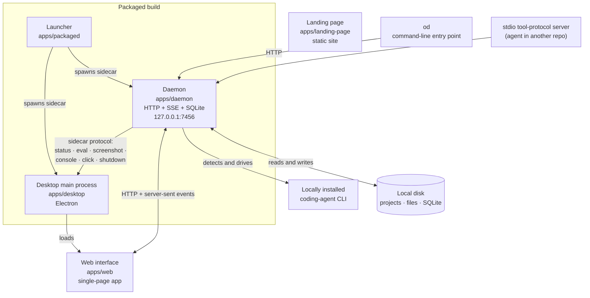

# Architecture overview

> [!IMPORTANT]
> Read from the vendored source and its own documentation. **Almost nothing below
> has been confirmed against a live process.** The exception: continuous
> integration has installed a built Windows application, launched it, had the
> running process answer its own health endpoint and uninstalled it — so the
> daemon, the web runtime, the desktop shell and the launcher have all been
> observed starting, once, together. Everything else — versions, ports, defaults,
> route counts, the subcommand list, the locales — is quoted from source.
>
> Each piece now has a page of its own; this one is the map. See
> [daemon.md](daemon.md), [web-runtime.md](web-runtime.md),
> [desktop-shell.md](desktop-shell.md), [packaged-runtime.md](packaged-runtime.md)
> and [data-directory.md](data-directory.md).

## Behaviour

### What the product does

A local daemon detects whichever coding-agent command-line tool the user already
has installed and drives it to produce single-page design artifacts — web,
desktop and mobile prototypes, live dashboards, decks, images, video and motion
graphics — shaped by a reusable design-system definition. Output is rendered in a
sandboxed preview frame and exported to HTML, PDF, slide decks, archives,
Markdown or video.

Everything is local: projects, generated files, and the SQLite database all live
on the machine's own disk. The daemon binds the loopback interface by default and
makes no outbound call the user did not ask for.

The product is also usable **without its interface**. The `od` command-line entry
point drives the same daemon, and a stdio tool-protocol server lets an agent
working in another repository read and write the live design files directly
rather than exporting an archive and importing it somewhere else.

### The domain vocabulary

| Term | Meaning |
| --- | --- |
| **Project** | The top-level workspace. Contains conversations and design files. |
| **Normal artifact** | An entry file plus an artifact manifest. |
| **Live artifact** | A refreshable artifact carrying source data and preview state, so it can be re-rendered against new data. |
| **Active project** | The project the interface and the command-line entry point currently act on. |
| **Chip rail** | The row of scoping controls above the prompt composer. |
| **Composer surface** | The multi-frame authoring surface used for motion output. |

## The five processes



The landing page is drawn detached because it is: it ships nothing into the
application and has no runtime relationship with the other four.

### Daemon — `@open-design/daemon`

The only stateful process, and the only one that touches disk. It owns:

- **The HTTP surface.** 38 route files register 351 route handlers covering 304
  distinct path patterns. Grouped and listed in [../api/README.md](../api/README.md).
- **Server-sent event streams** for run progress, project file events, plugin
  events, memory events and library events.
- **The database.** An embedded SQLite file with vacuum and verify operations
  exposed over HTTP.
- **The agent-runtime registry.** 26 runtime definitions backed by 25 distinct
  local executables — the daemon looks for each on the machine and reports which
  are present, then drives whichever the user selects.
- **The bring-your-own-key proxy**, at `/api/proxy/<provider>/stream`.
- **The `od` command-line entry point** — the same binary, invoked differently.
- **Export**, including the paths that rasterise through the desktop shell's
  bundled browser engine.

<details>
<summary><b>Daemon dependency pins</b> — the exact versions the vendored source declares</summary>

| Dependency | Version | Role |
| --- | --- | --- |
| Express | 5.2.1 | HTTP. Note: version 5 route wildcards are named (`*splat`), not bare `*`. |
| better-sqlite3 | 12.10.0 | Embedded database. No prebuilt binary for Windows on this runtime — see [../build/from-source.md](../build/from-source.md). |
| node-pty | 1.1.0 | Terminal sessions exposed under `/api/projects/:id/terminals`. |
| Model-context-protocol SDK | 1.29.0 | The stdio tool-protocol server. |
| multer | 2.1.1 | Upload handling. |
| undici | 7.25.0 | Outbound HTTP, including the proxy. |
| prom-client | 15.1.3 | Metrics at `/api/metrics`. |
| pptxgenjs | 4.0.1 | Slide-deck export. |
| pdf-lib | 1.17.1 | PDF export. |
| jszip | 3.10.1 | Archive export. |
| cheerio | 1.2.0 | HTML inlining for export. |
| chokidar | 3.6.0 | File watching behind the project file-event stream. |

</details>

### Web — `@open-design/web`

The single-page interface. React 18.3.1 on Next 16.2.6 (App Router), Tailwind
4.3.0, with a rich-text editor, syntax highlighting, an animation library and a
whiteboard component. It talks to the daemon over HTTP and server-sent events and
holds no durable state of its own.

In a packaged build the daemon serves the built assets, and the daemon's
catch-all route (`/*splat`) is the single-page-app fallback. In development the
web app runs on its own dev server and the two are wired together by the
development tool.

**19 locales ship.** `en`, `id`, `de`, `zh-CN`, `zh-TW`, `pt-BR`, `es-ES`, `ru`,
`fa`, `ar`, `ja`, `ko`, `pl`, `hu`, `fr`, `uk`, `tr`, `th`, `it`. Hong Kong
Cantonese (`zh-HK`) is **not** among them — see
[../standards/language-modes.md](../standards/language-modes.md).

### Desktop — `@open-design/desktop`

The Electron 41.3.0 main process. It owns the application window and exposes a
sidecar control channel to the daemon with six operations — status, evaluate,
screenshot, console, click, shutdown. That channel is how the daemon's export
pipeline reaches a real browser engine to rasterise PDF, image and slide output,
and how the development tool inspects a running desktop build headlessly.

This is where the frameless-window and custom title-bar work landed: Windows now
opens a window with no operating-system caption bar and a renderer-drawn Material
Design 3 title bar driven over dedicated inter-process channels. Every such file
sits under `design/`, so each one needed a `MODIFICATIONS.md` allowlist entry
before it could be edited — see
[../porting/verification.md](../porting/verification.md). The chrome decisions,
the two options deliberately rejected, and the one Windows 11 behaviour that does
not survive are in [desktop-shell.md](desktop-shell.md).

### Packaged — `@open-design/packaged`

The launcher for a shipped build. It starts the daemon and the desktop shell as
sidecar processes, supervises them, and bundles itself with esbuild. This is the
process a user's installed application actually launches.

### Landing page — `@open-design/landing-page`

A static Astro 6.3.5 site with its own check-and-build pipeline, served during
development on loopback port **17574**. It is independent of the application and
is subject to the same standards as any other user-facing surface — see
[../standards/](../standards/).

## Shared packages

14 package directories under `design/packages/`, plus a workspace `AGENTS.md`
file:

`agui-adapter` · `components` · `contracts` · `diagnostics` · `download` ·
`host` · `launcher-proto` · `metatool` · `platform` · `plugin-runtime` ·
`registry-protocol` · `release` · `sidecar` · `sidecar-proto`

`contracts` carries the shared types across the daemon/web boundary; `release`
holds the product name and per-channel application identities, which is one of
the branding touch points; `sidecar-proto` and `launcher-proto` define the
inter-process protocols; `components` is the shared interface component library.

Package versions are `0.16.1` throughout, except `@open-design/components` at
`0.8.0` and `@open-design/tools-serve` at `0.6.0`.

## Tool workspaces

| Workspace | Role |
| --- | --- |
| `tools/dev` | Starts, stops, inspects and checks the development stack. Allocates ports, exports them to the child processes, and can drive a running desktop build headlessly (status, screenshot). |
| `tools/pack` | Packaging. Builds the desktop application and the platform installers via electron-builder 26.8.1. |
| `tools/release` | Release orchestration. |
| `tools/serve` | Serving built output. |

The workspace layout is `packages/*`, `apps/*`, `tools/*`, and `e2e`.

## The command-line entry point's role

`od` is not a wrapper around the interface — it is the same daemon, entered
differently. Running `od` with no subcommand **starts the daemon and opens the
web interface**; running it with a subcommand performs that operation against a
daemon (starting one if needed) and exits.

That design is why the product is usable headlessly at all: an agent in another
repository, a script, or a scheduled job can drive the same operations the
interface drives, against the same database, with no interface running.

**Root options**

| Option | Default | Environment variable |
| --- | --- | --- |
| `--port <n>` | `7456` | `OD_PORT` |
| `--host <addr>` | `127.0.0.1` | `OD_BIND_HOST` |
| `--no-open` | — | — |

<details>
<summary><b>All 37 subcommands</b> — the complete dispatch map</summary>

```
artifacts   media       mcp             byok        amr
project     automation  automations     memory      message-center
research    plugin      ui              marketplace share
brand       brands      run             files       templates
conversation chat       deploy          daemon      atoms
skills      design-systems              craft       diagnostics
export      status      version         whats-new   doctor
config      library     figma
```

37 keys resolve to 35 distinct handlers — `brands` is an alias of `brand`, and
`automations` an alias of `automation`.

</details>

The binary at `design/apps/daemon/bin/od.mjs` requires the daemon's compiled
output to exist; on a source tree that has not been built it fails with a message
telling you to run the bootstrap step. See
[../build/from-source.md](../build/from-source.md).

## Configuration

### Ports and bind addresses

| Surface | Default | How to change |
| --- | --- | --- |
| Daemon HTTP | `http://127.0.0.1:7456` | `--port` / `OD_PORT`, `--host` / `OD_BIND_HOST` |
| Web dev server | dynamically allocated | `tools-dev run web --web-port <n>`, exported to the child as `OD_WEB_PORT` |
| Daemon in development | dynamically allocated | `tools-dev run web --daemon-port <n>`, exported as `OD_PORT` |
| Landing page dev server | `127.0.0.1:17574` | its own workspace configuration |

Development ports are allocated dynamically unless pinned explicitly, so two
stacks can run side by side. The development tool exports `OD_PORT` and
`OD_WEB_PORT` to its children; a general-purpose port variable is deliberately
not used.

### Environment variables

| Variable | Effect |
| --- | --- |
| `OD_PORT` | Daemon listen port. Default `7456`. |
| `OD_BIND_HOST` | Daemon bind address. Default `127.0.0.1`. Setting anything else exposes the daemon beyond the local machine. |
| `OD_ALLOWED_ORIGINS` | Origins permitted by the request-origin guard. **Required** alongside a non-loopback bind. |
| `OD_API_TOKEN` | Shared-secret authentication. Required for the container deployment. |
| `OD_ALLOWED_INTERNAL_HOSTS` | Per-host opt-out from the proxy's private-network blocking. |
| `POSTHOG_KEY` / `POSTHOG_HOST` / `POSTHOG_ENV` | Telemetry destination credentials. **Not configured in this repository** — see below. |

### Runtime requirements

| Requirement | Value |
| --- | --- |
| Node | `~24` — declared in the workspace root and repeated by every package. The upstream documentation states plainly that Node 22 is not a supported substitute. |
| Package manager | pnpm `>=10.33.2 <11`, pinned to `10.33.2` |
| Native build toolchain | Required on Windows: the embedded database has no prebuilt binary for this platform/runtime pair and is compiled from source. See [../build/from-source.md](../build/from-source.md). |

## Failure modes

| Symptom | Cause | Response |
| --- | --- | --- |
| `od` exits telling you to bootstrap | The daemon's compiled output is absent | Run the bootstrap/install step; the command-line entry point loads built output, not source. |
| Port already in use on `7456` | Another daemon instance, or an unrelated service | `--port` / `OD_PORT`, or stop the other instance. |
| Requests rejected by the origin guard | The daemon is bound beyond loopback without `OD_ALLOWED_ORIGINS` | Set the allowed origins explicitly. The guard failing closed is correct behaviour. |
| Proxy refuses a target host | The target resolves to a private, link-local, carrier-grade-NAT or cloud-metadata address | Intentional. Opt a specific host out with `OD_ALLOWED_INTERNAL_HOSTS` only if you understand what you are re-enabling. |
| No agent runtimes detected | None of the 25 supported executables is on the path | Install one, or configure a local runtime profile. |
| Export to PDF, image or slides fails | The export path needs the desktop shell's bundled browser engine | Those formats require the desktop runtime; they are not available from a bare daemon. |
| Install fails compiling the database binding | Missing native build toolchain | See [../build/from-source.md](../build/from-source.md). |

## Security considerations

**Default posture is loopback-only.** The daemon binds `127.0.0.1`. Exposing it
on a network requires two deliberate acts — setting `OD_BIND_HOST` *and* setting
`OD_ALLOWED_ORIGINS` — and the container deployment additionally requires a
shared-secret token in `OD_API_TOKEN`. A daemon reachable from a network without
a token is an unauthenticated remote-code-execution surface, because driving a
local agent is exactly what it is for.

**The proxy blocks private address space by default.** Requests through
`/api/proxy/<provider>/stream` are guarded against server-side request forgery:
private, link-local, carrier-grade-NAT and cloud-metadata addresses are refused.
`OD_ALLOWED_INTERNAL_HOSTS` opts a named host out — a setting that should be
understood as re-enabling a class of attack for that host.

**Telemetry.** The vendored source contains a product-analytics integration.
Every entry point is a no-op unless a telemetry key is present in the
environment, and the upstream privacy documentation states that forks and
development builds without destination credentials send neither class of data.
**This repository configures no telemetry key**, so builds produced from it would
send nothing. That is a statement about configuration, not about code: the code
paths are present verbatim, because `design/` is a verbatim copy. Anyone
packaging a build must not add a key without disclosing it.

**Agent execution is the trust boundary.** The daemon's purpose is to detect and
execute local command-line tools with the user's own privileges. Anything that
can reach the daemon's API can do that. This is why the loopback default and the
origin guard matter more here than they would in an ordinary local web service.

**The vendored workflow definitions are inert and must stay inert.** 48 workflow
files exist under `design/.github/workflows/`. Continuous integration only reads
`.github/workflows/` at the repository root, so none of them runs — the root
holds three deliberately written workflows of this project's own (`Verify`,
`Release` and `Pages`), and nothing from the vendored tree. Promoting them
wholesale would enable 48 unreviewed workflows at once. See
[../build/ci.md](../build/ci.md) and [../site/](../site/).

## Verification

**Verified from the tree while writing this page:** the workspace layout, the
package and application inventory (14 package directories under
`design/packages/`, counted), the runtime version constraints, the package
manager pin, and that the root `.github/workflows/` directory holds three
workflows of this project's own while the vendored 48 stay under `design/`.

**Quoted from source, not observed:** every port number, the default bind
address, the subcommand list, the route counts, the dependency versions, and the
19 locales.

**Observed once, in continuous integration:** that a built Windows application
installs, launches, answers its own health endpoint with the expected version, can
be evaluated and screenshotted through the desktop shell's control channel, and
uninstalls leaving no residue. That exercises the launcher, the daemon, the web
runtime and the desktop shell together — see
[../release/packaged-smoke-test.md](../release/packaged-smoke-test.md) for exactly
what it asserted, and what it did not.

**Not verified:** every route but the health probe, every stream, every export
path, the agent-runtime detection results, and every platform other than Windows.

The following confirm the claims on this page against a running build:

```bash
# the daemon answers where it says it does
curl -sf http://127.0.0.1:7456/api/health
curl -sf http://127.0.0.1:7456/api/version

# the command-line entry point resolves
od version
od status
od doctor

# the development stack reports its own topology
pnpm tools-dev status --json
```

## Suggested reading

- [daemon.md](daemon.md) — the stateful process, in detail
- [data-directory.md](data-directory.md) — the invariant every path in the product obeys
- [../api/README.md](../api/README.md) — the daemon's HTTP surface in full
- [../build/from-source.md](../build/from-source.md) — the exact commands to make any of this run
- [../porting/verbatim-import.md](../porting/verbatim-import.md) — why `design/` cannot be edited casually
- [../standards/material-design-3.md](../standards/material-design-3.md) — what the interface is being changed into
